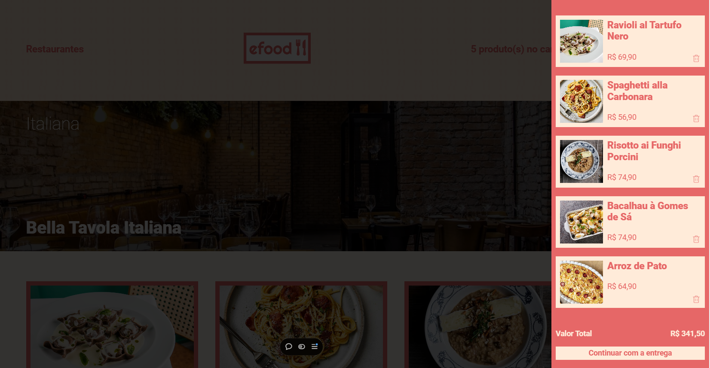

# eFood 🍽️

**eFood** é uma aplicação de loja online onde usuários podem explorar restaurantes e seus pratos disponíveis. Ao acessar a página de um restaurante, é possível visualizar os pratos oferecidos e adicionar os itens desejados ao carrinho, além de ver informações detalhadas sobre cada prato.



## Funcionalidades

- **Adicionar ao Carrinho**: Adicione pratos ao carrinho para um pedido personalizado.
- **Remover do Carrinho**: Remova itens do carrinho com facilidade.
- **Preço Total**: Visualize o valor total dos itens selecionados no carrinho.
- **Detalhes do Prato**: Exiba informações detalhadas sobre o prato em uma modal.
- **Formulário de Entrega e Pagamento**: Com validação de campos e máscaras, utilizando Formik, Yup e React Input Mask.
- **Loaders**: Indicadores visuais de carregamento com React Spinners.
- **Envio de Dados do Formulário**: Envia informações de entrega e pagamento para uma API, retornando o número do pedido.

## Tecnologias Utilizadas

- **React**
- **Styled-components**: Estilização de componentes.
- **React Router DOM**: Gerenciamento de rotas e navegação entre páginas.
- **Redux** e **Redux Toolkit Query**: Gerenciamento de estado e requisições de dados.
- **Formik** e **Yup**: Validação e gerenciamento de formulários.
- **React Input Mask**: Máscaras para campos de entrada.
- **React Spinners**: Indicadores de carregamento.

## APIs Utilizadas

- **Restaurantes**: https://fake-api-tau.vercel.app/api/efood/restaurantes
- **Detalhes do Restaurante**: https://fake-api-tau.vercel.app/api/efood/restaurantes/:id  
  (Substitua `:id` pelo ID do restaurante para obter informações sobre ele)
- **Finalizar Pedido**: Endpoint para envio dos dados do formulário e obtenção do número do pedido: https://fake-api-tau.vercel.app/api/efood/checkout

## Como Usar

1. Clone o repositório e instale as dependências:
   ```bash
   git clone https://github.com/FabioMedeiros1000/efood.git
   cd efood
   npm install
   ```

2. Inicie a aplicação:

  ```bash
  npm start
  ```

3. Acesse a aplicação no navegador:
  ```bash
  http://localhost:3000
  ```

## Demonstração
[Link para demonstração do projeto](https://efood-flm.vercel.app/)

Observação: Este projeto foi criado para fins educacionais e usa uma API simulada para os dados dos restaurantes e pratos.
